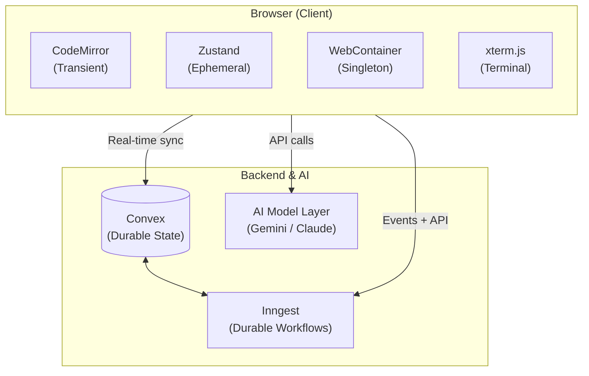
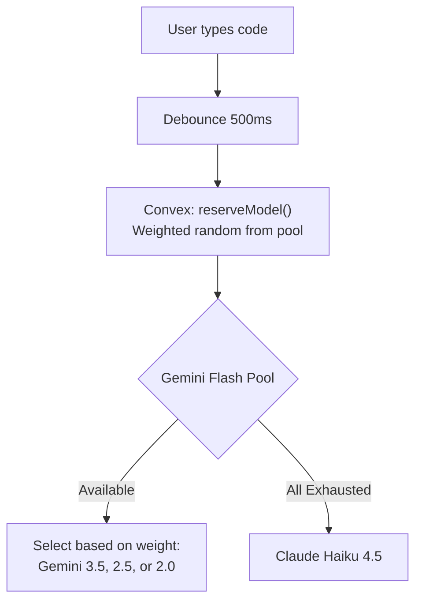
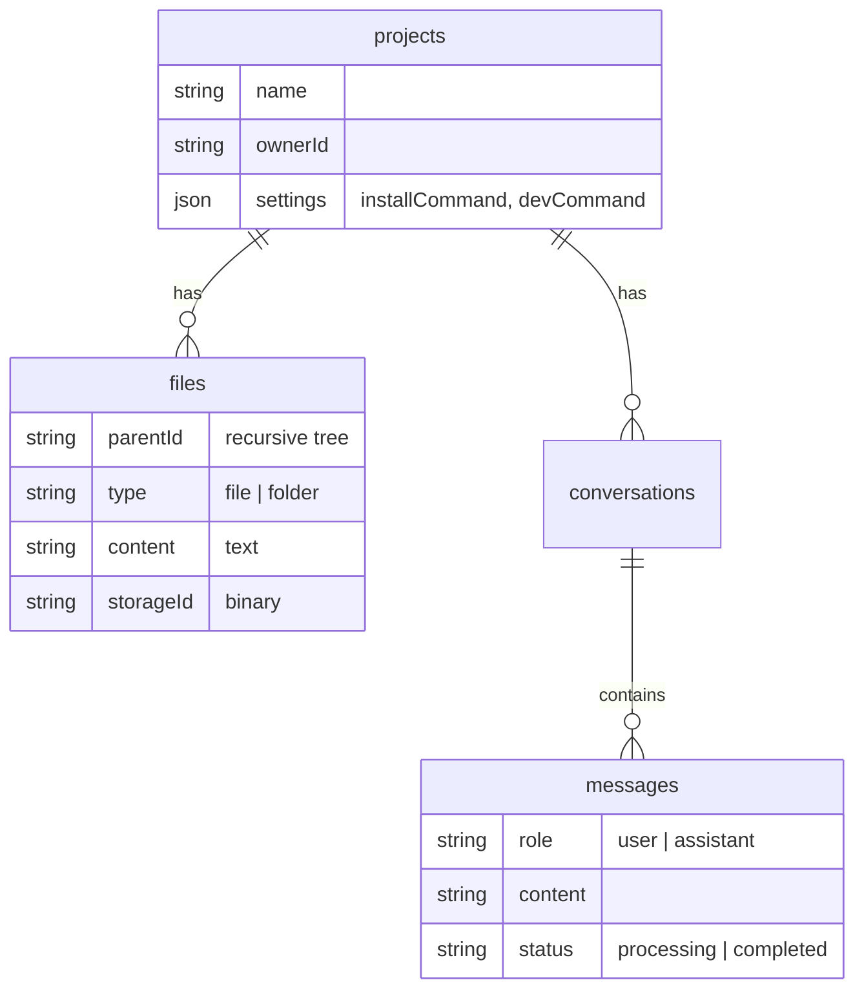
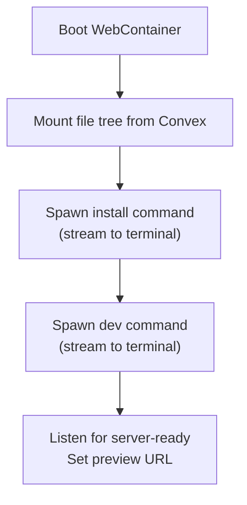

<div align="center">
  
  <h1>Curate</h1>
  <p><strong>An AI-native browser IDE for building software without leaving the web.</strong></p>

  <p>
    
    
    
    
  </p>
</div>

<br />

## 📸 Quick Demo

<div align="center">

https://github.com/user-attachments/assets/4f2a4c17-830a-4344-aa94-cb1c175ec9ef

  <br />
  <p>
    <a href="https://idecurate.vercel.app"></a>
    <a href="https://idecurate.vercel.app/learnings"></a>
    <a href="https://youtu.be/kqRMQaGJtqk"></a>
  </p>
</div>

<br />

---

## 📖 Table of Contents

- [What is Curate?](#-what-is-curate)
- [Core Capabilities](#-core-capabilities)
- [Architecture Overview](#%EF%B8%8F-architecture-overview)
- [AI System Design](#-ai-system-design)
- [Data Model](#-data-model)
- [WebContainer Lifecycle](#-webcontainer-lifecycle)
- [Key Engineering Decisions](#%EF%B8%8F-key-engineering-decisions)
- [Tech Stack](#%EF%B8%8F-tech-stack)
- [Project Structure](#-project-structure)
- [Local Development](#-local-development)
- [Security Model](#-security-model)
- [Deployment Architecture](#-deployment-architecture)
- [Roadmap](#-roadmap)

---

## 🚀 What is Curate?

Curate is a full-featured browser IDE that combines a real code editor, AI coding assistant, live preview environment, and GitHub integration into one cohesive tool. Users can create projects, import from GitHub, edit with AI-powered assistance, preview results instantly, and export back to GitHub — all without installing anything locally.

**The key technical challenge:** Coordinate durable cloud state (Convex), ephemeral browser state (Zustand), transient editor state (CodeMirror), background AI workflows (Inngest + AgentKit), and a browser-local Node.js runtime (WebContainers) into a seamless, responsive experience.

---

## ✨ Core Capabilities

| Capability             | What it does                                                        | How it works                                                                   |
| :--------------------- | :------------------------------------------------------------------ | :----------------------------------------------------------------------------- |
| 💻 **Code Editor**     | Full CodeMirror 6 workspace with tabs, minimap, syntax highlighting | Custom extensions for ghost text, selection editing, indentation markers       |
| 👻 **AI Ghost Text**   | Real-time inline autocomplete as you type                           | Gemini Flash pool (Convex-reserved) → Claude Haiku fallback, 500ms debounce    |
| 🪄 **AI Quick Edit**   | Select code → describe a change → get instant edit                  | Haiku for <1500 chars, Sonnet for larger selections, with URL context scraping |
| 🤖 **AI Coding Agent** | Full file-aware agent that creates, reads, updates, deletes files   | AgentKit network with 8 tools, Sonnet, maxIter 5, cancellable via events       |
| ⚡ **Live Preview**    | Browser-local dev server with integrated terminal                   | WebContainer singleton with managed lifecycle, auto-install, hot-reload        |
| 📥 **GitHub Import**   | Import GitHub repositories                                          | Inngest workflow: fetch tree → sort by depth → create nodes → handle binaries  |
| 📤 **GitHub Export**   | Push project back to GitHub as a new repository                     | Inngest workflow: rebuild paths → create blobs → single commit → update ref    |

---

## 🏗️ Architecture Overview

### System Layout



### 🔄 State Lifecycle Separation

This is the most important architectural decision in Curate. Different types of state have different lifecycles, persistence requirements, and latency profiles:

| Layer               | Owner        | Lifecycle     | Persistence                 | Latency             |
| :------------------ | :----------- | :------------ | :-------------------------- | :------------------ |
| **Keystrokes**      | CodeMirror   | Local browser | None                        | Must feel immediate |
| **Editor chrome**   | Zustand      | Session       | In-memory only              | Instant             |
| **Project data**    | Convex       | Permanent     | Cloud database              | Network round trip  |
| **Background work** | Inngest      | Minutes       | Durable, survives tab close | Async               |
| **Browser runtime** | WebContainer | Session       | Re-mounts from Convex       | Multi-step boot     |

**Why this matters:** A naive approach would put everything in the database, but autocomplete and cursor interactions cannot wait on backend round trips. Conversely, storing files only in memory loses data on tab close. Each layer handles exactly the state it is suited for.

---

## 🧠 AI System Design

### Model Routing Strategy

Curate uses model specialization — not a single "default model" — to optimize cost, latency, and capability per task:



| Route                   | Model             | Selection Criteria     | Why This Model                                                              |
| :---------------------- | :---------------- | :--------------------- | :-------------------------------------------------------------------------- |
| **Ghost text**          | Gemini Flash pool | Always first choice    | Autocomplete needs high capacity and low latency, not deep reasoning.       |
| **Ghost text fallback** | Claude Haiku 4.5  | Gemini quota exhausted | Gives suggestions a second provider before the UI reports quota exhaustion. |
| **Small quick edit**    | Claude Haiku 4.5  | Selection < 1500 chars | Fast, cheap. Small edits don't need heavy reasoning.                        |
| **Large quick edit**    | Claude Sonnet 4.6 | Selection ≥ 1500 chars | Larger context needs better code understanding and preservation.            |
| **Coding agent**        | Claude Sonnet 4.6 | Always                 | Best balance of tool use, code quality, and cost.                           |
| **Title generation**    | Claude Haiku 4.5  | Always                 | Tiny deterministic task. 50 max tokens, temperature 0.                      |

### Gemini Quota Management

Autocomplete is the highest-frequency AI operation. Curate manages Gemini quotas through a distributed Convex mutation.

Each suggestion request checks all models against a **95% safety margin** (`reserveSuggestionModel`). Available models enter a **weighted random pool** to avoid write contention caused by round-robin counters. On quota exhaustion, the API route falls back to Claude Haiku.

### Agent System

The coding agent uses Inngest AgentKit with a single-agent network:

1. Wait 1s for DB sync (eventual consistency gap).
2. Fetch conversation context.
3. If default title → spawn Haiku title agent.
4. Create Sonnet coding agent with **8 tools** (listFiles, readFiles, createFiles, updateFile, createFolder, renameFile, deleteFiles, scrapeUrls).
5. Run network (maxIter: 5). Stop only when text response is ready with no tool calls.
6. Support cancellation via `message/cancel` event.

> **System Prompt Design:** Uses XML tags (`<identity>`, `<environment>`, `<tools>`) because Claude models parse XML-structured prompts with higher fidelity than markdown. Tools use Zod validation and return recoverable error strings for self-correction.

---

## 🗄️ Data Model



**File system design:** Files use a recursive `parentId` structure rather than path strings. This enables O(1) rename/move operations, requiring parent-chain traversal only for GitHub export and WebContainer mounting.

---

## ⚡ WebContainer Lifecycle

The WebContainer lifecycle is carefully managed due to its singleton constraint (SharedArrayBuffer limitation):



**Critical detail:** If a user navigates away while booting, Curate waits for boot to complete before tearing down (`cleanupPromise`). Orphaned instances cause "Only a single WebContainer instance" errors on subsequent boots.

**File sync:** Curate syncs files regardless of container status, preventing edits from being lost during the initial boot phase.

---

## ⚖️ Key Engineering Decisions

| Technology        | Why It Was Chosen                                                                                                   | Tradeoffs Accepted                                                                                            |
| :---------------- | :------------------------------------------------------------------------------------------------------------------ | :------------------------------------------------------------------------------------------------------------ |
| **Convex**        | Real-time file sync, durable document storage, binary storage (`_storage`), and cross-session AI quota tracking.    | Requires dual auth model (Clerk for users + internal API key for background workers).                         |
| **Inngest**       | Background work survives tab close, supports cancellation (`cancelOn`), failure recovery, and step-based workflows. | Requires placeholder DB rows and status fields for tracking progress.                                         |
| **WebContainers** | Zero-install browser Node.js runtime, sandbox isolation, and instant feedback loops.                                | Singleton constraint per tab. Requires global COEP/COOP headers. No SSR frameworks (Next.js, Nuxt) supported. |
| **Clerk**         | Drop-in OAuth, session management, and identity tokens for Convex validation.                                       | Relies on edge middleware (`proxy.ts`) to protect routes.                                                     |

---

## 🛠️ Tech Stack

| Category            | Technology                                |
| :------------------ | :---------------------------------------- |
| **Framework**       | Next.js 16.2 (Turbopack)                  |
| **Language**        | TypeScript 5.x                            |
| **Database**        | Convex 1.41                               |
| **Background Jobs** | Inngest 3.54 + AgentKit 0.13              |
| **AI SDKs**         | `@ai-sdk/anthropic`, `@ai-sdk/google`     |
| **Editor**          | CodeMirror 6                              |
| **Preview**         | WebContainer API 1.6 + xterm.js           |
| **UI**              | Radix UI + Tailwind CSS 4 + Framer Motion |

---

## 📂 Project Structure

```text
curate/
├── convex/              # Convex backend (schema, CRUD, quota management)
├── src/
│   ├── app/             # Next.js routes, API handlers, Inngest webhooks
│   ├── features/        # Feature modules (editor, preview, conversations, projects)
│   ├── inngest/         # Inngest workflows and AgentKit tools
│   ├── lib/             # Utilities and AI model definitions
│   └── proxy.ts         # Clerk edge middleware
└── next.config.ts       # COEP/COOP headers + Sentry + Turbopack
```

---

## 💻 Local Development

### Prerequisites

- Node.js 20+
- [Convex](https://convex.dev) account & [Clerk](https://clerk.com) application
- API Keys for Anthropic & Google AI

### Setup

```bash
git clone https://github.com/hiverkiya/Curate.git
cd Curate
npm install
```

Create a `.env.local` file with the required variables:

| Variable                            | Required | Purpose                              |
| :---------------------------------- | :------- | :----------------------------------- |
| `NEXT_PUBLIC_CLERK_PUBLISHABLE_KEY` | ✅       | Clerk frontend auth                  |
| `CLERK_SECRET_KEY`                  | ✅       | Clerk server auth                    |
| `NEXT_PUBLIC_CONVEX_URL`            | ✅       | Convex deployment URL                |
| `CONVEX_DEPLOYMENT`                 | ✅       | Convex deployment identifier         |
| `CURATE_CONVEX_INTERNAL_KEY`        | ✅       | Shared secret for Inngest → Convex   |
| `ANTHROPIC_API_KEY`                 | ✅       | Claude models (agent, edits, titles) |
| `GOOGLE_GENERATIVE_AI_API_KEY`      | ✅       | Gemini models (suggestions)          |
| `FIRECRAWL_API_KEY`                 | ✅       | URL scraping for quick edit context  |
| `SENTRY_DSN`                        | —        | Error monitoring                     |

### Run

```bash
npm run dev
```

This formats the codebase, then concurrently starts the **Next.js** dev server (port 3000), **Convex** dev server, and **Inngest** dev server (port 8288, webhooks to localhost:3000).

---

## 🔒 Security Model

| Boundary                  | Mechanism                                                                        |
| :------------------------ | :------------------------------------------------------------------------------- |
| **User → API routes**     | Clerk `auth()` in every route handler                                            |
| **User → Convex queries** | `verifyAuth()` checks `ctx.auth.getUserIdentity()`                               |
| **Inngest → Convex**      | `validateInternalKey()` checks `CURATE_CONVEX_INTERNAL_KEY`                      |
| **Edge middleware**       | `proxy.ts` protects all routes except `/`, `/learnings`, `/test`, `/api/inngest` |
| **WebContainer**          | Sandboxed WASM runtime, no host filesystem access                                |
| **COEP/COOP**             | Required for SharedArrayBuffer, applied globally via `next.config.ts`            |

> ⚠️ **Important:** `CURATE_CONVEX_INTERNAL_KEY` bypasses all Clerk auth checks. It provides service-to-service authentication for Inngest workers. Treat it as a highly sensitive secret.

---

## 🌍 Deployment Architecture

Curate is designed as a hosted web app with a browser-local preview runtime:

| Runtime piece    | Deployment role                                                                                                               |
| :--------------- | :---------------------------------------------------------------------------------------------------------------------------- |
| **Next.js app**  | Serves the dashboard, public pages, API routes, and `/api/inngest` webhook handler.                                           |
| **Convex**       | Stores projects, files, conversations, binary storage IDs, AI usage counters, and backend functions.                          |
| **Inngest**      | Calls Curate's API handler for durable AI, import, and export workflows.                                                      |
| **Clerk**        | Owns user sessions and GitHub OAuth tokens used by import/export routes.                                                      |
| **WebContainer** | Runs user project installs/dev servers locally in the browser; Curate does not run arbitrary project code on its own backend. |

---

## 🗺️ Things To Improve

- Add granular telemetry for model latency, cost, and fallback frequency
- Surface per-file GitHub import validation errors to users
- Expand automated testing for routing, agent tools, and WebContainer paths
- Replace hard-coded model routing thresholds with telemetry-driven tuning
- Add structured error classes to agent tools for better post-failure analysis
